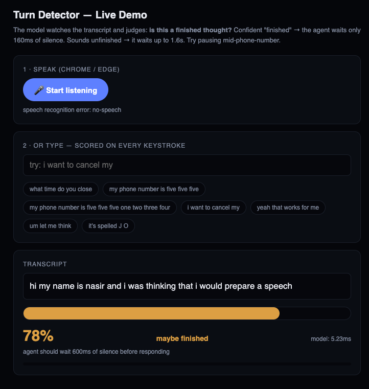

# Turn Detector — End-of-Turn Detection for Voice AI Agents

A **turn detection
model** that decides when the caller has finished speaking and the agent should
respond — trained, evaluated, served, and stress-tested.

## The problem

A voice agent must respond quickly without interrupting the user. A plain VAD
silence timeout can't do both: short timeouts cut people off mid-phone-number,
long timeouts make every reply feel sluggish. Humans solve this with semantics
("What time do you close?" is obviously finished; "my number is five five
five…" obviously isn't) — so the detector must too.

## The solution

A fine-tuned **MiniLM-L6 encoder (22M params)** reads the streaming STT
transcript tail and outputs `P(complete)`. That probability drives a **dynamic
silence timeout** (160ms when confident the turn is over, up to 1600ms when
mid-thought), gated by VAD so the model can never interrupt active speech. A
3s hard ceiling guarantees the agent always responds, and an 80ms client
deadline fails open to a fixed timeout if the service is ever slow or down.

Served as **INT8 ONNX (23 MB) on CPU** behind FastAPI, with warmup-gated
readiness, Prometheus metrics, and a Dockerfile.

```
VAD pause ─► detector scores transcript tail ─► arm timer (recommended_timeout_ms)
             new speech cancels ─► timer expiry = END_OF_TURN ─► LLM
```

## Results

| | Accuracy | Macro-F1 | Notes |
|---|---|---|---|
| Majority baseline | 54.4% | 0.352 | sanity floor |
| Punctuation + function-word heuristic | 85.3% | 0.847 | strongest non-ML rule |
| **Fine-tuned MiniLM (this project)** | **95.2%** | **0.952** | ROC-AUC 0.990 |
| INT8 quantized (served artifact) | 95.1% | — | −0.13 pts for 4× smaller |

**The number that matters most**: at the fast-response threshold (p ≥ 0.90),
precision on COMPLETE is **0.981** — when the agent decides to answer quickly,
it interrupts the caller less than 2% of the time.

**Latency** (M1 Max, local loopback; requirement was <100ms):

| Setting | Throughput | p50 | p99 |
|---|---|---|---|
| Sequential | 345 req/s | 2.7 ms | 5.0 ms |
| Concurrency 8 | 929 req/s | 7.2 ms | 23.1 ms |
| Docker (same host, VM overhead) | 449 req/s | 12.5 ms | 85 ms |

Model inference alone is ~1.5 ms. Full details and analysis: `RESULTS.md`.

## Data

165k labeled examples, built by script ([data/build_dataset.py](data/build_dataset.py)):

- **COMPLETE**: 87k real conversational turns (DailyDialog).
- **INCOMPLETE**: synthetic truncations — 60% cut right after words that cannot
  end a sentence (guaranteed-correct labels), 40% random cuts (so the model
  can't learn a function-word shortcut).
- **Hard cases**: ~100 curated templates (mid-phone-number, mid-spelling,
  fillers, one-word answers) expanded with random entities.
- **ASR realism**: 40% of examples lowercased/de-punctuated to match streaming
  STT output.
- **No leakage**: splits by conversation and by template — never by utterance.

## Assumptions

1. A streaming STT runs upstream and provides interim + final transcripts;
   the detector reads text, not raw audio (audio is a designed upgrade path —
   the API reserves an `audio_b64` field).
2. A VAD runs upstream; the detector is consulted at speech→silence
   transitions and only modulates how much silence is required — it never
   fires during active speech.
3. One caller per call (no diarization / multi-party).
4. English v1; multilingual is designed (same recipe on a multilingual
   encoder) but not trained, per the time budget.
5. STT punctuation/casing quality varies by vendor — handled via
   punctuation-dropout training, not assumed reliable.
6. Policy thresholds/timeouts are deployment config, tunable without
   retraining.

## Repository layout

```
data/               dataset builder + curated hard cases
training/           train.py, export_onnx.py (ONNX + INT8 quantization)
evaluation/         evaluate.py (model vs baselines), latency_bench.py (stress test)
serving/            FastAPI app, decision policy, smoke test, Dockerfile
```

Supporting documents (shared separately, not tracked in this repo):
`TURN_DETECTION.md` (design & trade-offs), `RESULTS.md` (measured findings),
`MONITORING.md` (production monitoring plan, Step 4), `DISCUSSION.md`
(limits & alternatives, Step 5).

## Quickstart

```bash
python3 -m venv .venv
.venv/bin/pip install -r serving/requirements.txt        # serving only
# full pipeline additionally needs: datasets pandas torch transformers scikit-learn accelerate onnx httpx

.venv/bin/python data/build_dataset.py                   # 1. build dataset (~1 min)
.venv/bin/python training/train.py                       # 2. train (~16 min on M1 Max)
.venv/bin/python evaluation/evaluate.py                  #    evaluate vs baselines
.venv/bin/python training/export_onnx.py                 # 3. export INT8 ONNX

.venv/bin/uvicorn serving.app:app --port 8000 --workers 2   # serve
.venv/bin/python serving/test_inference.py                  # smoke test (10 cases)
.venv/bin/python evaluation/latency_bench.py --concurrency 8 # stress test

docker build -f serving/Dockerfile -t turn-detector .    # containerized
docker run -p 8000:8000 turn-detector
```

Try it by hand:

```bash
curl -s -X POST http://127.0.0.1:8000/v1/turn \
  -H 'Content-Type: application/json' \
  -d '{"transcript": "my phone number is five five five"}' | python3 -m json.tool
# → probability_complete ≈ 0.03, recommended_timeout_ms: 1600  (caller isn't done — wait)
```

## Live demo (speak to it)

With the server running, open **http://127.0.0.1:8000/** in Chrome or Edge and
click **🎤 Start listening** (allow microphone access). The browser's built-in
speech recognition stands in for the production STT and streams your words to
the model as you speak. Any browser can use the typing box instead — every
keystroke is scored.

### A real example



Speaking *"hi my name is nasir and i was thinking that i would prepare a
speech"* and pausing produced:

| UI element | Showed | What it means |
|---|---|---|
| Transcript box | `hi my name is nasir and i was thinking that i would prepare a speech` | What the speech recognizer heard — the exact text the model judges. Gray words are still tentative (the recognizer may revise them); solid words are final. |
| Confidence meter + `78%` | amber bar, ~¾ full | `probability_complete` — the model's confidence this is a *finished thought* (0–100%). Here it hedges: the sentence is grammatically complete, but "…prepare a speech" is often continued ("…about my trip"). **Red** <30% = clearly mid-thought, **amber** = ambiguous, **green** ≥90% = confidently finished. |
| Verdict label: `maybe finished` | amber text | `decision_hint` — the probability translated into one of three bands: `sounds unfinished` / `maybe finished` / `sounds finished`. |
| `agent should wait 600ms of silence before responding` | — | `recommended_timeout_ms` — the **dynamic timeout**, the whole point of the system: ≥90% confidence → wait only **160ms**; ambiguous → **600–1000ms**; clearly unfinished → **1600ms**. The wait adapts to how done you sound. |
| `model: 5.23ms` | — | `inference_ms` — how long the model itself took to judge. Any lag you *feel* is the free browser STT, not the model (production STT is much faster). |
| Thin blue countdown bar | filling up | The recommended silence elapsing in real time. **Speaking again resets it** — demonstrating the safety rule that the model can never interrupt live speech, it only decides how long silence must last. |
| **🤖 Agent would respond now** banner | flashes ~2s after the bar fills | The simulated moment a real agent would start talking — there's no LLM/TTS behind the demo, so the banner stands in for the agent's voice. Each flash ends one "turn"; the transcript resets for the next. |
| Pill buttons (e.g. `my phone number is five five five`) | — | One-click canonical hard cases from the dataset, for trying contrasts instantly without speaking. |

### The contrast worth trying

1. Say **"what time do you close"** and stop → green, ~160–600ms, banner
   almost immediately. Snappy agent.
2. Say **"my phone number is five five five"** and stop → deep red, 1600ms of
   patience — this is the exact moment a fixed-timeout system would have
   interrupted you, and this one doesn't. Then finish the digits and watch it
   flip green.

One honest detail the demo surfaces: browser STT sends lowercase, unpunctuated
text, so `what time do you close` scores ~0.67 while `What time do you close?`
scores ~0.98 — the punctuation-dropout training (the 40%) is what keeps the
unpunctuated version on the right side of the decision, and the residual gap is
part of why an audio/prosody model is the designed next step.


